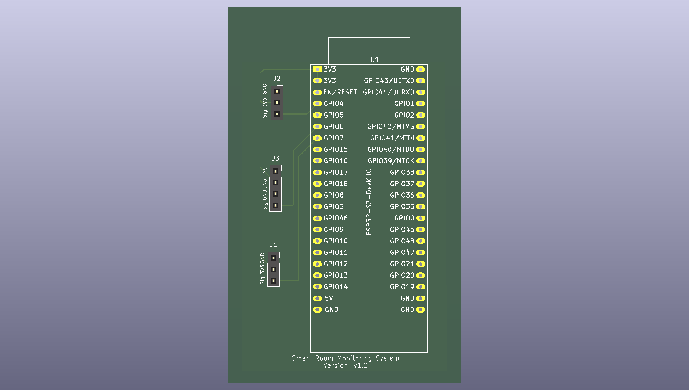

<div align="center">
  
</div>

# Smart Room Monitoring System

The **Smart Room Monitoring System (SRMS)** is an IoT-based environmental monitoring project for measuring room temperature, humidity, ambient light, and noise.

Sensor data is published through **MQTT**, received by a Python subscriber, stored in **SQLite**, and displayed through a **Flask dashboard**.

The project contains three main implementation stages:

- original multi-controller physical prototype,
- single ESP32-S3 FreeRTOS simulation,
- custom ESP32-S3 carrier PCB design in KiCad.

> **Project Status: Complete**

---

### System Architecture

```text
Sensors
   │
   ▼
Embedded Sensor Node(s)
   │
   ▼
MQTT / HiveMQ
   │
   ▼
RoomMonitorClient.py
   │
   ▼
SQLite Database
   │
   ▼
Flask Dashboard
```

The original prototype and ESP32-S3 revision use the same MQTT interface, allowing the existing backend to remain unchanged.

---

### Physical Prototype

The original implementation uses multiple microcontrollers as independent sensor publishers.

#### Hardware

| Component | Quantity | Purpose |
|---|---:|---|
| ESP32 | 1 | Sensor acquisition / MQTT publisher |
| Arduino WiFi Rev2 | 2 | Sensor acquisition / MQTT publishers |
| Raspberry Pi 3 Model B v2 | 1 | Backend / client host |
| KY-015 | 1 | Temperature and humidity |
| KY-018 | 2 | Ambient light sensing |
| KY-037 / KY-038 | 1 | Sound / noise sensing |

#### Communication

| Interface | Usage |
|---|---|
| Wi-Fi | Network connectivity |
| MQTT | Sensor data transport |
| SQLite | Persistent data storage |
| Flask / HTTP | Dashboard interface |

Original publisher firmware:

```text
Project/src/sensor-publishers/
```

---

### ESP32-S3 Revision

The embedded architecture was redesigned around a **single ESP32-S3**.

Instead of using separate microcontrollers for each sensor publisher, one ESP32-S3 handles sensor acquisition and MQTT communication.

#### Simulation Hardware

| Device | Signal | ESP32-S3 Pin |
|---|---|---:|
| KY-018 / Photoresistor | Analog Output | GPIO4 |
| KY-037 / Microphone | Analog Output | GPIO6 |
| KY-015 / DHT11 | Data | GPIO7 |

### Cirkit Designer

[ESP32-S3 SRMS Simulation](https://app.cirkitdesigner.com/project/668acf81-1f05-40f3-9d74-6e21bc692d80)

---

### FreeRTOS Architecture

The ESP32-S3 implementation uses separate FreeRTOS tasks for sensor acquisition and MQTT communication.

```text
DHT Task -----------\
Light Task ----------> FreeRTOS Queue -> MQTT Task -> HiveMQ
Microphone Task ----/
```

| Task | Responsibility |
|---|---|
| `DHT Task` | Read temperature and humidity |
| `Light Task` | Read photoresistor ADC values |
| `Microphone Task` | Read microphone ADC values |
| `MQTT Task` | Maintain network connection and publish sensor data |

The queue separates sensor acquisition from network communication and keeps the embedded architecture modular.

---

### MQTT Interface

#### Broker

| Parameter | Value |
|---|---|
| Broker | `broker.hivemq.com` |
| Port | `1883` |
| Protocol | MQTT |

#### Topics

| Sensor | MQTT Topic | Example Payload |
|---|---|---|
| Temperature / Humidity | `sensor/ky-015/temperature-humidity/data` | `{"temperature":25.0,"humidity":60.0}` |
| Light | `sensor/ky-018/photoresistor/data` | `{"brightness":68}` |
| Microphone | `sensor/ky-037/microphone/data` | `{"noise":42}` |

---

### Backend

#### MQTT Subscriber

```text
Project/src/client/RoomMonitorClient.py
```

The Python client:

1. connects to the MQTT broker,
2. subscribes to all sensor topics,
3. parses incoming JSON data,
4. timestamps each measurement,
5. stores the readings in SQLite.

#### Database

```text
Project/db/Sensor_Reading_Records.db
```

| Table | Stored Data |
|---|---|
| `temperature_humidity_readings` | temperature, humidity |
| `photoresistor_readings` | light intensity |
| `microphone_readings` | sound level |

#### Dashboard

```text
Project/src/dashboard/Flask-Server.py
```

The Flask dashboard reads the latest values from SQLite and displays the current room status.

---

### End-to-End Validation

The ESP32-S3 simulation was validated with the existing backend.

```text
Cirkit Sensors
      │
      ▼
ESP32-S3 + FreeRTOS
      │
      ▼
MQTT Publisher
      │
      ▼
HiveMQ
      │
      ▼
Python Subscriber
      │
      ▼
SQLite
      │
      ▼
Flask Dashboard
```

Sensor values changed in the simulation are successfully published through MQTT, received by the Python client, stored in the database, and made available to the dashboard.

---

### PCB Design

The final project stage was a custom **ESP32-S3 carrier PCB** designed in KiCad.



#### PCB Features

- ESP32-S3 DevKitC integration
- KY-015, KY-018 and KY-037 sensor connectors
- GPIO4, GPIO6 and GPIO7 sensor routing
- shared 3.3 V power distribution
- B.Cu ground plane
- ESP32 antenna copper keepout
- silkscreen pin labels
- completed ERC and DRC checks
- Gerber and drill-file generation

#### Sensor Connections

| Connector | Sensor | Pin Mapping |
|---|---|---|
| J1 | KY-015 | GND / 3V3 / SIG |
| J2 | KY-018 | GND / 3V3 / SIG |
| J3 | KY-037 | NC / 3V3 / GND / SIG |

KiCad source files are available in:

```text
Project/pcb/
```

The PCB was completed as a **design exercise** and is not intended for fabrication as part of this project.

---

### Project Demo

A recorded demonstration is available in:

```text
Project/demo/
```

[View Project Demo](demo/Project_Demo.mp4)

---

### Repository Structure

```text
Project/
│
├── README.md
│
├── analysis/
├── datasheets/
├── db/
│   └── Sensor_Reading_Records.db
│
├── demo/
│   └── Project_Demo.mp4
│
├── img/
│   └── SRMS-PCB.png
│
├── pcb/
│   ├── esp32-SRMS.kicad_pro
│   ├── esp32-SRMS.kicad_sch
│   └── esp32-SRMS.kicad_pcb
│
├── src/
│   ├── client/
│   │   └── RoomMonitorClient.py
│   │
│   ├── dashboard/
│   │   └── Flask-Server.py
│   │
│   └── sensor-publishers/
│       ├── Temperature-Humidity-Sensor.ino
│       ├── photoregister.ino
│       └── Microphone.ino
│
├── Technical Documentation/
└── requirements.txt
```

---

### Run the Project

#### Create Virtual Environment

```shell
python3 -m venv .venv
```

#### Activate Environment

Linux / macOS:

```shell
source .venv/bin/activate
```

Windows:

```shell
.venv\Scripts\activate
```

#### Install Dependencies

```shell
pip install -r Project/requirements.txt
```

#### Run MQTT Client

```shell
cd Project/src/client
python3 RoomMonitorClient.py
```

#### Run Dashboard

Open another terminal:

```shell
cd Project/src/dashboard
python3 Flask-Server.py
```

---

### Project Status

| Stage | Status |
|---|---|
| Original physical prototype | ✅ Complete |
| MQTT publishers | ✅ Complete |
| Python MQTT subscriber | ✅ Complete |
| SQLite storage | ✅ Complete |
| Flask dashboard | ✅ Complete |
| ESP32-S3 simulation | ✅ Complete |
| FreeRTOS architecture | ✅ Complete |
| End-to-end MQTT validation | ✅ Complete |
| KiCad schematic | ✅ Complete |
| PCB layout and routing | ✅ Complete |
| Ground plane and antenna keepout | ✅ Complete |
| ERC / DRC validation | ✅ Complete |
| Gerber generation | ✅ Complete |
| PCB manufacturing | Out of scope |

---

### Resources

- [HiveMQ](https://www.hivemq.com/blog/implementing-mqtt-in-python/)
- [Paho MQTT Python](https://www.emqx.com/en/blog/how-to-use-mqtt-in-python)
- [Paho MQTT Documentation](https://eclipse.dev/paho/files/paho.mqtt.python/html/client.html#paho.mqtt.client.Client.connect)
- [HiveMQ Security Fundamentals](https://www.hivemq.com/blog/mqtt-security-fundamentals-securing-mqtt-systems/)
